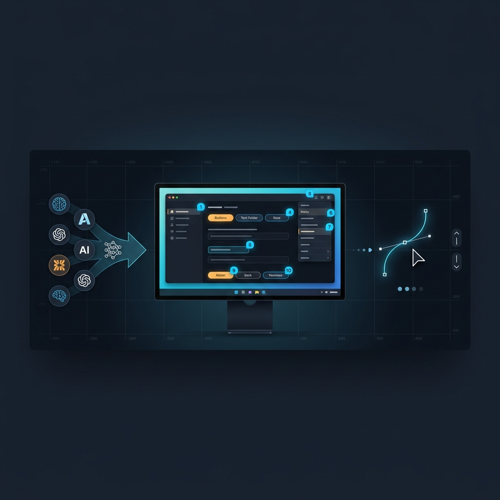
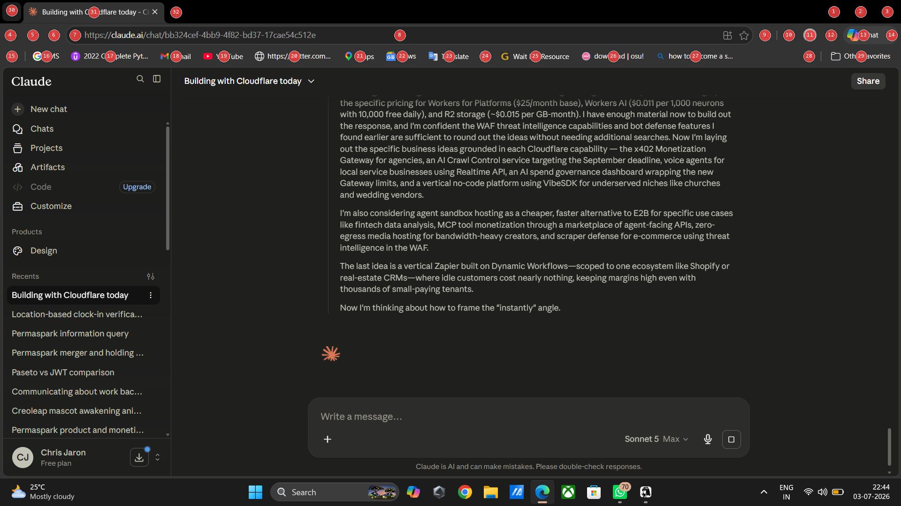
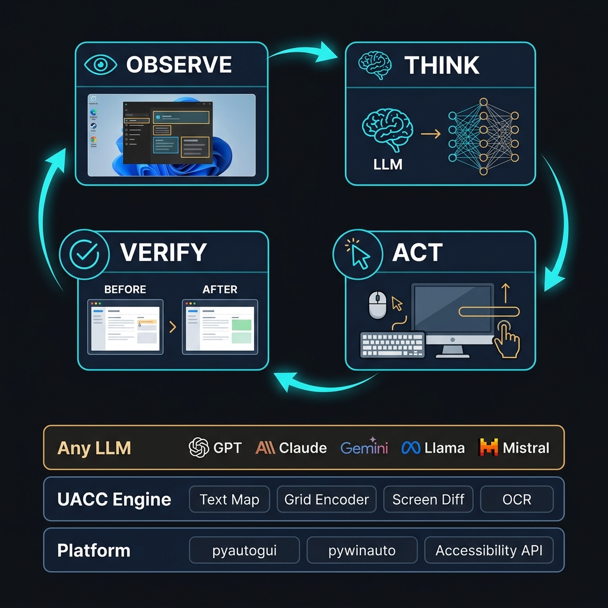

<p align="center">
  
</p>

<h1 align="center">🖥️ UACC — Universal AI Computer Control</h1>

<p align="center">
  <strong>Give any LLM the power to control a computer with pixel-precise UI interactions.</strong><br>
  <em>Open-source • Works with any model • Vision optional • MCP-native</em>
</p>

<p align="center">
  <a href="https://modelcontextprotocol.io"></a>
  <a href="https://www.python.org/downloads/"></a>
  <a href="LICENSE"></a>
  <a href="CHANGELOG.md"></a>
  <a href="https://github.com/yourusername/uacc/stargazers"></a>
  <a href="CONTRIBUTING.md"></a>
</p>

<p align="center">
  <a href="#-quick-start">Quick Start</a> •
  <a href="#-mcp-server">MCP Server</a> •
  <a href="#-three-modes">Three Modes</a> •
  <a href="#-why-uacc">Why UACC?</a> •
  <a href="#-architecture">Architecture</a> •
  <a href="#-examples">Examples</a> •
  <a href="CONTRIBUTING.md">Contributing</a>
</p>

---

## 🔥 The Problem

ChatGPT Work costs $200/mo. Claude Cowork is enterprise-only. Every major AI lab is building **closed-source** computer control agents locked to their own models.

**UACC is the open-source alternative.**

It works with **any LLM** — GPT-4o, Claude, Gemini, Llama, Mistral, Qwen, Phi — through a single unified interface. Your model, your rules, your data.

> **💡 The secret weapon:** UACC doesn't even need a vision model. Text-only LLMs can "see" the screen through structured text maps with exact coordinates. Run Llama locally and control your desktop — no API costs, no cloud, no vision model required.

---

## ✨ Key Features

| Feature | Description |
|---------|-------------|
| 🔌 **MCP Server** | Works with Claude Code, Claude Desktop, Hermes, OpenCode, OpenClaw, Cursor — any MCP client |
| 🤖 **Any LLM** | GPT-4o, Claude, Gemini, Llama, Mistral, Qwen, Phi — any OpenAI-compatible API |
| 👁️ **Vision Optional** | Text-only models get a structured "text map" of the screen with exact coordinates |
| 🎯 **Pixel Precise** | Sub-10px accuracy via progressive zoom and coordinate grid overlays |
| 🖱️ **Human-Like** | Bézier curve mouse movement, variable typing speed, natural pauses |
| ✅ **Self-Verifying** | Pre/post action verification with automatic coordinate correction |
| 🛡️ **Safe Mode** | Blocks destructive actions (delete, format, rm -rf) — enabled by default |
| ⚡ **Lightweight** | `pip install` and go. No Docker, no sandbox, no heavy infrastructure |

---

## 🚀 Quick Start

Get UACC running in under 2 minutes:

```bash
# 1. Clone & install
git clone https://github.com/yourusername/uacc.git
cd uacc
pip install -e .

# 2. Configure (set your API key)
cp .env.example .env
# Edit .env → OPENAI_API_KEY=sk-...

# 3. See what a text-only LLM sees (no mouse control, safe to run)
python examples/demo_text_map.py

# 4. See what a vision LLM sees (saves grid overlay images)
python examples/demo_grid.py

# 5. Run the full agent!
python examples/open_notepad.py --mode hybrid
```

---

## 🔌 MCP Server

**The fastest way to use UACC** — expose computer control as tools any AI agent can call via the [Model Context Protocol](https://modelcontextprotocol.io).

```bash
# Install
pip install -e .

# Run (stdio transport — works with Claude Code, Hermes, Cursor, etc.)
uacc-mcp

# Or use SSE/HTTP for remote clients
uacc-mcp --transport streamable-http --port 8765
```

### What an AI Agent Sees

When an agent calls `get_screen_info`, it receives a structured map of every interactive element:

```
Screen: 1920x1080 | Window: "Visual Studio Code"
─── Interactive Elements ───
  [e1] button         "File"                    at (22, 15)      clickable
  [e2] button         "Edit"                    at (67, 15)      clickable
  [e3] text_input     "Search"                  at (680, 12)     editable
  [e15] tree_item     "📁 src"                   at (110, 90)     expandable (expanded)
```

Then it calls `click(x=22, y=15)` to click "File", or `find_element(name="Save")` to locate a button. **No vision model needed.**

### Available Tools (25 total)

| Tool | Category | Description | Example |
|------|----------|-------------|---------|
| `screenshot` | Screen Understanding | Capture full screen or a region | See what's on screen |
| `get_screen_info` | Screen Understanding | Get structured text map of all UI elements | Find interactive elements |
| `find_element` | Screen Understanding | Search for UI elements by name/type | Find the "Save" button |
| `get_mouse_position` | Screen Understanding | Get current cursor position | Find cursor position |
| `click` | Mouse & Keyboard | Click at exact coordinates | Click at (500, 300) |
| `click_element` | Mouse & Keyboard | Click by element name (smart targeting) | Click "Save" |
| `type_text` | Mouse & Keyboard | Type text via keyboard | Type text into active field |
| `hotkey` | Mouse & Keyboard | Press key combinations | Ctrl+S to save |
| `scroll` | Mouse & Keyboard | Scroll at a position | Scroll down a page |
| `drag` | Mouse & Keyboard | Drag from point A to B | Drag icon to folder |
| `hover` | Mouse & Keyboard | Move mouse and wait | Hover to trigger tooltip |
| `get_active_window` | Window Management | Get focused window details & state | See active window title |
| `list_windows` | Window Management | List all visible windows with positions | Find background windows |
| `focus_window` | Window Management | Bring a window to foreground by title | Bring notepad to front |
| `resize_window` | Window Management | Resize a window by title | Resize browser to 1280x720 |
| `move_window` | Window Management | Move a window by title | Move window to (0,0) |
| `minimize_maximize` | Window Management | Min/max/restore a window | Maximize notepad |
| `launch_app` | Applications | Launch an application by name or path | Launch "notepad" |
| `open_url` | Applications | Open a URL in default browser | Open "https://google.com" |
| `clipboard_read` | Clipboard | Read clipboard text content | Extract copied text |
| `clipboard_write` | Clipboard | Write text to clipboard | Set text for pasting |
| `wait_for_element` | Reliability | Poll screen until element appears | Wait for "Untitled - Notepad" |
| `get_action_history` | Reliability | Review recent actions | Debug agent actions |
| `paint_preset` | Art & Painting | Paint preset designs inside MS Paint | Paint "rose", "galaxy", "peacock" |
| `paint_image` | Art & Painting | Contour sketch any image inside MS Paint | Sketch outline of "my_image.png" |

### Transport Modes

| Transport | Command | Best For |
|-----------|---------|----------|
| **stdio** (default) | `uacc-mcp` | Claude Code, Claude Desktop, Cursor, Hermes, OpenClaw, OpenCode |
| **SSE** | `uacc-mcp --transport sse --port 8765` | Legacy remote clients |
| **Streamable HTTP** | `uacc-mcp --transport streamable-http --port 8765` | OpenCode (remote), OpenClaw (remote), web clients |

### Client Configuration

<details>
<summary><strong>Claude Code</strong></summary>

```bash
# Add UACC as an MCP server (project scope)
claude mcp add uacc -- uacc-mcp

# Or with environment variables
claude mcp add uacc -e UACC_SAFE_MODE=true -- uacc-mcp

# Verify
claude mcp list
```

For global access across all projects:
```bash
claude mcp add --scope user uacc -- uacc-mcp
```

</details>

<details>
<summary><strong>Claude Desktop</strong></summary>

Add to your `claude_desktop_config.json`:

```json
{
  "mcpServers": {
    "uacc": {
      "command": "uacc-mcp",
      "args": [],
      "env": {
        "UACC_SAFE_MODE": "true"
      }
    }
  }
}
```

> **Config file location:**
> - **Windows:** `%APPDATA%\Claude\claude_desktop_config.json`
> - **macOS:** `~/Library/Application Support/Claude/claude_desktop_config.json`
> - **Linux:** `~/.config/Claude/claude_desktop_config.json`

</details>

<details>
<summary><strong>Hermes</strong></summary>

Add to your `~/.hermes/config.yaml`:

```yaml
mcp_servers:
  uacc:
    command: "uacc-mcp"
    args: []
    env:
      UACC_SAFE_MODE: "true"
```

Or via the CLI:
```bash
hermes mcp add uacc -- uacc-mcp
```

</details>

<details>
<summary><strong>OpenCode</strong></summary>

Add to your `opencode.json` (project root or `~/.config/opencode/opencode.json`):

**Local (stdio):**
```json
{
  "mcp": {
    "uacc": {
      "type": "local",
      "command": ["uacc-mcp"],
      "enabled": true
    }
  }
}
```

**Remote (streamable HTTP):**
```json
{
  "mcp": {
    "uacc": {
      "type": "remote",
      "url": "http://localhost:8765/mcp",
      "enabled": true
    }
  }
}
```

When using remote mode, start the server with:
```bash
uacc-mcp --transport streamable-http --port 8765
```

</details>

<details>
<summary><strong>OpenClaw</strong></summary>

Via the CLI:
```bash
openclaw mcp add uacc -- uacc-mcp
```

Or add to `~/.openclaw/openclaw.json`:
```json
{
  "mcpServers": {
    "uacc": {
      "command": "uacc-mcp",
      "args": []
    }
  }
}
```

You can also manage it through the OpenClaw Control UI at the **/mcp** tab.

</details>

<details>
<summary><strong>Cursor / VS Code</strong></summary>

Add to your MCP settings (`.cursor/mcp.json` or VS Code MCP config):

```json
{
  "mcpServers": {
    "uacc": {
      "command": "uacc-mcp",
      "args": []
    }
  }
}
```

</details>

---

## 💻 Standalone Web Dashboard

UACC includes a stunning, premium Web UI Dashboard to run the agent in standalone mode. It works as a full-featured desktop control panel comparable to ChatGPT Work or Claude Cowork.

### Starting the Dashboard
Launch the server using the shortcut console command:
```bash
uacc-ui --port 8000
```
Then navigate to `http://localhost:8000` in your web browser.

### Key Capabilities
- 📺 **Live Desktop Feed**: View your screen state in real-time, downsampled for low latency.
- 🕹️ **Interactive Control HUD**: Type natural language commands to initiate OS automation tasks.
- 💼 **Job Finder Assistant**: Specialized pipeline that navigates boards, scrapes listings, and compiles structured markdown lists with direct apply links.
- 🔬 **Research Lab**: Traces recursive queries across multiple pages to compile extensive long-form reports.
- 🎨 **Artistic Painter Console**: Directly trigger vector drawing presets (rose, galaxy, peacock, mountains) inside Microsoft Paint.
- ⚙️ **Config HUD**: Toggle Safe Mode, adjust iteration thresholds, and configure human-mimicry speed profiles on-the-fly.

---

## 🧠 Three Modes

UACC adapts to any LLM — whether it can see images or not.

### Text Mode — No Vision Required

```python
from uacc.agent.controller import Agent

agent = Agent(mode="text", model="llama3.1:70b", base_url="http://localhost:11434/v1")
result = agent.run("Open Calculator and compute 42 × 7")
```

The LLM receives a **structured text map** instead of a screenshot:

```
Screen: 1920x1080 | Window: "Calculator"
─── Interactive Elements ───
  [e1] button    "1"     at (500, 600)    clickable
  [e2] button    "2"     at (570, 600)    clickable
  [e3] button    "+"     at (710, 600)    clickable
  ...
```

> **💡 This is UACC's superpower.** Any text-only LLM — even a 7B model running on a laptop — can "see" and control a desktop. No vision API costs, no cloud dependencies.

### Vision Mode

```python
agent = Agent(mode="vision", model="gpt-4o")
result = agent.run("Take a screenshot and describe what you see")
```

The LLM receives a screenshot with **numbered badges** on every interactive element:

<p align="center">
  
</p>

### Hybrid Mode (Best Accuracy)

```python
agent = Agent(mode="hybrid", model="gpt-4o")
result = agent.run("Open Notepad and type 'Hello from UACC!'")
```

Gets **both** the screenshot + text map. Cross-validates visual and textual understanding for maximum accuracy.

---

## 🎨 Artistic Painting Mode

UACC features a fully dedicated vector path-tracing engine that enables AI agents to paint presets or load images from disk, convert them to edge contours, and paint them directly on screen in Microsoft Paint using smooth drag-and-drop stroke trajectories.

### Preset Paintings
No complex configuration needed — just invoke the `paint_preset` tool with a design name:
- `rose` — A mathematical Rhodonea curve
- `galaxy` — A double spiral galaxy pattern
- `mountains` — A mountain silhouette with a rising sun
- `peacock` — The iconic detailed peacock illustration

### Edge Tracing & Image Painting
Convert any image on your disk (PNG, JPEG) into vector outline drawing paths in Paint:
```json
{
  "action": "paint_image",
  "image_path": "C:/path/to/my_image.png",
  "max_strokes": 150
}
```
UACC uses Pillow's `FIND_EDGES` filter, downsamples the outlines to prevent cluttering, and traces the lines using fast, contiguous path-tracing strokes.

---

## 🤔 Why UACC?

### vs. Closed-Source Solutions (Mid-2026)

| Capability | UACC (Open-Source) | ChatGPT Work (Closed) | Claude Cowork (Closed) |
|---|:---:|:---:|:---:|
| **Open Source & Extensible** | ✅ MIT License | ❌ Proprietary | ❌ Proprietary |
| **Any LLM Support** | ✅ GPT-4o, Claude, Gemini, Llama, Qwen, Phi | ❌ GPT only | ❌ Claude only |
| **Self-Hosted / Local-First** | ✅ Run locally (no cloud mandatory) | ❌ Cloud-only | ❌ Cloud-only |
| **Vision-Optional (Text Maps)**| ✅ Structured text-map feeds | ❌ Vision required | ❌ Vision required |
| **Safety Guardrails** | ✅ Custom safe-mode filters | ⚠️ Cloud-enforced limits | ⚠️ Enterprise policy |
| **Extensible MCP Tools** | ✅ Standard SSE/stdio/HTTP MCP | ❌ No public MCP server | ❌ No public MCP server |
| **Operating Cost** | ✅ Free (BYO API key / Local model) | 💰 $200/month | 💰 Enterprise pricing |

### vs. Open-Source Competitors

| Feature | UACC (Ours) | trycua/cua | OpenOwl | Windows MCP | UFO |
|---|:---:|:---:|:---:|:---:|:---:|
| **MCP Tools** | **23 Tools** | 25 Tools | 12 Tools | 10 Tools | N/A (Python framework) |
| **Vision Optional** | ✅ (Text Map + OCR) | ❌ (Screenshots only) | ❌ (Screenshots only) | ❌ (Accessibility only) | ❌ (Accessibility only) |
| **Smart Click-by-Name**| ✅ (Fuzzy name matching) | ⚠️ (Element Index only) | ❌ (Coordinates only) | ❌ (Coordinates only) | ⚠️ (COM API target) |
| **UI Polling & Wait** | ✅ (`wait_for_element`) | ❌ (Manual sleeps) | ❌ (Manual sleeps) | ❌ (Manual sleeps) | ❌ (Manual sleeps) |
| **Human Mimicry** | ✅ (Bézier curves + typing) | ❌ (Instant click/type) | ❌ (Instant click/type) | ❌ (Instant click/type) | ❌ (Instant click/type) |
| **Zero VM Required** | ✅ (`pip install -e .`) | ❌ (Requires Lume/VM) | ✅ (`pip install`) | ✅ (`pip install`) | ⚠️ (Requires setup) |
| **Clipboard Support** | ✅ (Native Win32 & ctypes) | ✅ (Command wrapper) | ❌ | ❌ | ❌ |
| **Multi-Monitor** | ✅ (Native resolution maps) | ⚠️ (Primary display) | ❌ | ⚠️ (Primary display) | ❌ |
| **Safety Mode** | ✅ (Regex action patterns) | ⚠️ (VM-dependent) | ❌ | ❌ | ❌ |

---

## 🏗️ Architecture

<p align="center">
  
</p>

### The Agent Loop

```
┌─────────────────────────────────────────────────────────┐
│                   UACC Agent Loop                       │
│                                                         │
│  👁️ OBSERVE ──→ 🧠 THINK ──→ ▶️ ACT ──→ ✅ VERIFY     │
│      ↑                                       │          │
│      └───────────────────────────────────────┘          │
│                                                         │
│  1. Capture screen + build text map/grid overlay        │
│  2. Send to LLM: "What action should I take?"           │
│  3. Execute action with human-like mouse/keyboard       │
│  4. Verify the action had the expected effect            │
│  5. Repeat until task is complete                       │
└─────────────────────────────────────────────────────────┘
```

### System Architecture

```
┌──────────────────────────────────────────────────────┐
│          AI Agent / MCP Client                        │
│   Claude Code │ Hermes │ OpenCode │ OpenClaw          │
│   Claude Desktop │ Cursor │ Any MCP Client            │
├──────────────────────────────────────────────────────┤
│        MCP Protocol                                   │
│   stdio │ SSE │ Streamable HTTP                       │
├──────────────────────────────────────────────────────┤
│              UACC MCP Server                          │
│   screenshot │ click │ type │ hotkey │ scroll         │
│   drag │ hover │ find_element │ get_screen_info       │
├──────────────────────────────────────────────────────┤
│          LLM Adapters                                 │
│   Text │ Vision │ Hybrid                              │
├──────────────────────────────────────────────────────┤
│           UACC Core Engine                            │
│   Text Map │ Grid Encoder │ Screen Diff               │
│   Accessibility Tree │ OCR │ Safe Mode                │
├──────────────────────────────────────────────────────┤
│            Platform Layer                             │
│   pyautogui │ pywinauto │ EasyOCR │ mss               │
└──────────────────────────────────────────────────────┘
```

---

## 📂 Project Structure

```
uacc/
├── uacc/
│   ├── config.py              # Central configuration
│   ├── core/
│   │   ├── screen_capture.py  # Fast screenshot capture (mss)
│   │   ├── accessibility.py   # Windows UI Automation tree
│   │   ├── ocr_engine.py      # Text extraction (EasyOCR)
│   │   ├── text_map.py        # Structured screen representation
│   │   ├── grid_encoder.py    # Coordinate grid + markers
│   │   └── screen_diff.py     # Screen change detection
│   ├── actions/
│   │   ├── schema.py          # Action types (click, drag, type, etc.)
│   │   ├── executor.py        # Real input execution (pyautogui)
│   │   └── human_mimicry.py   # Bézier mouse paths, natural typing
│   ├── models/
│   │   ├── base_adapter.py    # Abstract LLM interface
│   │   ├── text_adapter.py    # For text-only models
│   │   ├── vision_adapter.py  # For vision models
│   │   └── hybrid_adapter.py  # Combined text + vision
│   └── agent/
│       ├── controller.py      # Observe → Think → Act → Verify loop
│       ├── memory.py          # Session memory & element cache
│       └── verifier.py        # Pre/post action verification
├── uacc_mcp/                  # MCP Server
│   ├── server.py              # MCP tools + resources
│   └── utils.py               # Image encoding, session state
├── examples/                  # Demo scripts
├── tests/                     # Unit tests
├── pyproject.toml
└── requirements.txt
```

---

## 📋 Examples

```bash
# See what a text-only LLM "sees" (safe, no mouse control)
python examples/demo_text_map.py

# See what a vision LLM sees (saves grid overlay images)
python examples/demo_grid.py

# Full agent: open Notepad and type text
python examples/open_notepad.py --mode hybrid

# Full agent: search the web
python examples/web_search.py "What is UACC?"

# Creative: draw in MS Paint
python examples/draw_in_paint.py
```

---

## 🧪 Testing

```bash
pip install -e ".[dev]"
python -m pytest tests/ -v
```

---

## ⚙️ Configuration

All settings via environment variables or `.env` file:

```bash
# LLM
OPENAI_API_KEY=sk-...          # Your API key
OPENAI_MODEL=gpt-4o            # Model name
OPENAI_BASE_URL=               # Custom endpoint (Ollama, vLLM, etc.)

# UACC
UACC_MODE=hybrid               # text | vision | hybrid
UACC_SAFE_MODE=true            # Block destructive actions
UACC_HUMAN_MIMICRY=true        # Bézier curve mouse movement
UACC_MAX_ITERATIONS=30         # Max agent iterations per task
UACC_GRID_MODE=medium          # coarse | medium | fine | micro
```

See [`.env.example`](.env.example) for the full list.

---

## ⚠️ Safety

UACC controls your **real mouse and keyboard**. Built-in protections:

- 🛡️ **Safe Mode** (on by default) — blocks destructive patterns (`delete`, `rm -rf`, `format`, etc.)
- 🖱️ **pyautogui failsafe** — move your mouse to any screen corner to instantly abort
- 📝 **Action logging** — every action is logged with coordinates and reasoning
- 🔒 **MCP boundaries** — the MCP server only exposes UI tools, no file/shell/network access

> **Tip:** Start with `demo_text_map.py` and `demo_grid.py` — they're read-only and don't control the mouse.

---

## 🗺️ Roadmap

- [ ] 🐧 Linux support (X11/Wayland accessibility)
- [ ] 🍎 macOS support (AppleScript + Accessibility API)
- [ ] 🌐 Browser-specific adapter (Playwright/Selenium integration)
- [ ] 📸 Video recording of agent sessions
- [ ] 🔄 Multi-monitor support
- [ ] 📊 Action replay and debugging UI
- [ ] 🧩 Plugin system for custom actions
- [ ] 🏋️ Benchmark suite for agent evaluation

---

## 🤝 Contributing

We welcome contributions of all kinds! See our [Contributing Guide](CONTRIBUTING.md) for details.

- 🐛 [Report a bug](../../issues/new?template=bug_report.md)
- ✨ [Request a feature](../../issues/new?template=feature_request.md)
- 📝 Improve documentation
- 🧪 Add test coverage

**Good first issues** are labeled and waiting for you — check the [issues page](../../issues?q=is%3Aissue+is%3Aopen+label%3A%22good+first+issue%22).

---

## 📄 License

[MIT](LICENSE) — use it, fork it, ship it.

---

## ⭐ Star History

If UACC is useful to you, consider giving it a star! It helps others discover the project.

[](https://star-history.com/#yourusername/uacc&Date)

---

<p align="center">
  <strong>Built for the agentic era.</strong><br>
  <em>UACC — because AI should work with any model, on any desktop, under your control.</em>
</p>
